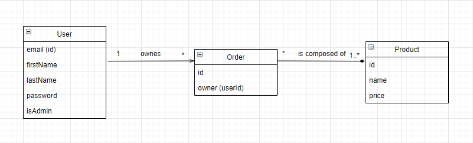

# AMT-project-02
## Objectives

The objectives of this project is to design, specify, implement and validate **2 RESTful APIs** using a set of technologies that build upon or complement Java EE standards. Namely, the goal is to use:

- **Spring Boot**, **Spring Data**, **Spring MVC** and **Spring Data** for the implementation of the endpoints and of the persistence;
- **Swagger** (**Open API**) to create a formal documentation of the REST APIs (this formal documentation has to be used in the development cycle);
- JSON Web Tokens (**JWT**) to secure the RESTful endpoints;
- **CucumberJVM** to implement BDD tests.

## The Back Market 2.0

Our application is a modified version of **The Black Market** from [AMT-Project-01]( https://github.com/Jostoph/AMT-project-01). Our business model has been simplified by removing the *OrderLine* entity so that a user can only get a quantity of 1 when adding a product to an *Order*. But on the other hand, it now uses a **JWT authorization** system with a dedicated **Authentication Sever** and **Users** received a **role** (Admin or Standard User) that makes it possible to restrain management operations to authorized **Users** only.

## Business Model



## Usage and Authorizations

- **Standard User**
  - Login
  - List all **Users**
  - Change his password
  - List all **Products**
  - Make **Orders**
  - See his **Orders**
- **Admin**
  - Everything from a standard **User**
  - Create / Delete **Users**
  - Change password from any **User**
  - Add **Products**
  - Remove **Products**

**Some additional info**:

- Users / Orders and Products are independent
  - We want to keep a trace of the **Orders** , Deleting a **User** won't delete his **Orders** .
  - A **Products** can only be deleted when it is not **ordered yet**. (Deletion in case of mistake at the creation is fine)
- The creation of an **Order** with invalid **Products** won't create the **Order** and tell it to the creator (as an error status)
- **Products** can have the same name, **the id is autogenerated**

## API Description

- /api-auth

| endpoint    | request type | parameters                 | return values                                                | description                                            |
| ----------- | ------------ | -------------------------- | ------------------------------------------------------------ | ------------------------------------------------------ |
| /connection | POST         | credentials                | - 200 with token<br />- 401 invalid credentials<br />- 500 token generation failure (should not happen) | Login to the authentication server and get a JWT token |
| /users      | POST         | User and jwt token         | -201 success<br />- 409 email already used<br />- 403 forbidden | Create a new user (need to be Admin)                   |
| /users      | GET          | jwt token                  | - 200 with Users array<br />- 403 forbidden                  | Get the list of users                                  |
| /users/{id} | DELETE       | jwt token                  | - 204 success<br />- 404 not found<br />- 403 forbidden      | Delete a user (Admin only)                             |
| /users/{id} | PATCH        | jwt token and new password | - 204 success<br />- 404 not found<br />- 403 forbidden      | Change a user password                                 |

- /api-shop

| endpoint       | request type | parameters                   | return values                                                | description                                  |
| -------------- | ------------ | ---------------------------- | ------------------------------------------------------------ | -------------------------------------------- |
| /products      | GET          | jwt token<br />page and size | - 200 array of products<br />- 400 bad request (page/size invalid)<br />- 403 forbidden | Get the list of products (pageable)          |
| /products      | POST         | jwt token<br />Product       | - 201 success<br />- 403 forbidden                           | Create a product (Admin only)                |
| /products/{id} | GET          | jwt token                    | - 200 the product<br />- 403 forbidden<br />- 404 not found  | Get a specific product by id                 |
| /products/{id} | DELETE       | jwt token                    | - 204 success<br />- 403 forbidden<br />- 404 not found      | Delete a specific product by id (Admin only) |
| /shop          | GET          | jwt token and user id        | - 200 array of orders<br />- 403 forbidden                   | Get the orders of a user                     |
| /shop          | POST         | jwt token and an order       | - 204 success<br />- 400 bad request (invalid product ids in the order)<br />- 403 forbidden | Make an order                                |
| /shop          | DELETE       | jwt token and order id       | - 204 success<br />- 403 forbidden<br />- 404 not found      | Delete an order (Admin only)                 |


## Pre-requisites

- [docker & docker-compose](https://www.docker.com/get-started)
- [maven](https://maven.apache.org/)

## Installation

Download or *pull* the project

## Configuration

You don't have anything special to do in order to run the application ! But if you want to run the tests (Cucumber) you will need to change a line in a *bash* script (see Run Tests).

## Run and use App

In the Root folder of the project, *run* the following command to **build** and **run** everything.

```bash
./run-all.sh
```

You can now access and test the **API** by accessing the following endpoints in a browser. This will redirect you to the *Spring boot API* testing interface where you can easily test the program manually.

- authentication service => http://{your docker host}/api-auth
- shop service => http://{your docker host}/api-shop

### Pre-Created users

To the test the API (you will need an admin account for some usages) you can use these existing account.

- [Admin] email: root@mail.com password: root
- [User] email: alice@mail.com password: 1234

## Run the tests

In order to run the tests you will first need to start everything by using, as above, the following instruction.

```bash
./run-all.sh
```

Before going further take a look in the **2 tests files** run-test.auth.sh and run-test-shop.sh to edit the docker host address according to your system. 

```bash
# change 'localhost' if needed (same for the shop file)

cd ./microservices/auth-service/users-specs
mvn -DserverAddress=http://localhost/api-auth clean test
```

When everything is ready you can now *run* the **auth-api** tests and/or the **shop-api** tests.

```bash
# auth-api tests
./run-test-auth.sh

# shop-api tests
./run-test-shop.sh

# run every tests
./run-test-all.sh
```

### Caution

The tests will alter the database and you will need to **restart the APIs** (run-all.sh) in order to clean it and **launch the tests again** without failures caused by creation of existing entities etc...

We are aware that problem and how to fix it but couldn't make it in time.

## Clean Up

When you are done testing the **APP** (manually or with the tests) it is recommended to run the clean up script that will execute the `docker-compose down` in the right folder.

```bash
./clean.sh
```

## Implementation

### Topology

- **alpine-java** images to run the severs .jar
- **mysq** images for the databases
  - The auth mysql database is field with some users at start-up
- **traefik** image used as a reverse proxy and load balancer

(Take a look in the `docker-compose.yml` file in the topology folder for more information)

### Security

To verify the jwt tokens we use an **Interceptor** class that will get a first look at the requests and verify if the token is valid, if it is the case it will be forwarded to the controllers. 

## JMeter results

Sadly we couln't make the JMeter tests in time, but our assuption about the loading tests would be that this servers (in opposition with the server from the first project) can handle a lot more connections since they are not using sessions. The Servers won't get overloaded with user sessions so we should be able to serve a lot more of them than before.
